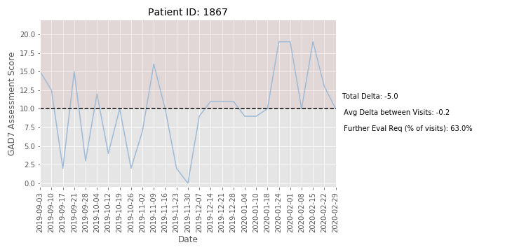

<p align="center">
    
</p>

## Jamie Wessels | NF-Take-Home 
# Part 1: GAD7 Analysis


## Purpose: 
The purpose of this analysis is to explore different ways to visualize patient progress, using the GAD7 assessment data.

## Data Pipeline:
The steps I took to clean and transform the data can be found in the data_pipeline.py file. There were no null values, however, I did find duplicates where patients had multiple scores listed for the same day.  For the purposes of this analysis, I assumed these were "retests" and averaged patient's scores that occurred within a single day.

Other transformations included in the pipeline: 
* data types (example: made sure 'date' columns were datetime objects)
* created column 'num_visit' to keep track of the visit count for each patient
* created column to look at score differences from previous assessment
* simulated ages for patients (using normal distribution centered at 30 y.o. and a sigma of 5 yrs)

## Patient look-up
The Patient.py file allows us to input a patient id for a quick visualization of their progress. The two figures below are examples of what this file outputs for Patient 9291 and 9027, respectively. 

<p align="center">
    
</p>

<p align="center">
    
</p>

### Thoughts on Improvement Metrics
It would be interesting to look at patients who specifically discontinue their sessions because they feel they no longer require therapy. Because mental health is fluid, this seems like a difficult task.  However, I think patterns in these specific patients' scores might be an interesting way to determine the best metric for measuring improvement. For example, if most patients who discontinue therapy have 3 consecutive scores less than 5, maybe it's worth tracking that for other patients.

## Closer look: Changes in Score from Previous Assessment
The figure below shows the distributions of the measured changes in scores from the previous assessment. For example, if a patient scored a 6 on their first assessment and a 10 on their second assessment, the change in score would be +4. The area between the vertical dashed lines captures 90% of the data across all patients and all visits.  These "warning boundaries" are located at -6 and +5.  A delta of +5 means that the patient's score went up by 5 points since the last assessment, meaning they are more at risk for GAD. Data outside of these boundaries can be considered more rare and might warrant further evaluation, even if the score falls below 10. 

* Note: even though a drop in score of 6 points would be considered a win (meaning patient appears to be less at risk for GAD based on the assessment), the data shows these "swings" to be rare (<5% of the time).  Therefore, identifying these larger changes might still be important.

<p align="center">
    
</p>

The graph below, although busy, shows some interesting trends. The change in scores are plotted against the number of visits and are colored by score.  Scores that required futher evaluation (score >= 10) are colored in a darker shade of blue than scores that were below the 10 point threshold.  


<p align="center">
    
</p>

I thought it was really interesting that scores tended to level off as the number of visit increased, meaning the changes in scores approach zero. This could simply be due to the fact that there were **significantly** more patients with low visit counts, adding to the variability (note: I included a distribution of these counts in the exploration section). Before making any conclusions, it would be important to address that confounding factor.  However, confounding factors aside, this chart did help me pinpoint several patients with concerning data.

For example, I noticed the two points on the upper right side of the graph (visits between 20-25 and change in score between 8-10), which corresponded to patient# 1867.  That specific patient's progress is shown below. Their  data indicates a clear shift during the month of February, that might be concerning.

<p align="center">
    
</p>

## Moving Forward: 
### Supplementing the Data
* If there are any open-ended text sections of the GAD7 assessment, it would be very interesting to perform a sentiment analysis using NLP to supplement the scores. I think there is a lot of power in combining what patients say with how they rate their feelings.  
* I'd love to have more information about each patient! What is their age? Have they had any major life events recently?  How did the doctor rate their overall state during the visit?  
* I know this assessment screens for GAD, but is there a final determination by the doctor?  If so, I'd love to look at those labels.  Additionally, it would be very interesting to see the patients' scores for the individual questions within the GAD7. 

### If I had additional time: 
* Seasonal effects: I'd like to look at the effect that time of year has on patients' overall scores.  Although every patient has their individual needs, I think it's important to look at this, as it can help organizations plan for increased demand by leveraging staff and other support tools.
* Patient-specific traits: I created a simulated column for age because having more information about the patients could shed light on their risk.  I did not have time to explore whether age had an effect on score (although I don't expect to see a signal because I randomly assigned ages using a normal distribution centered at 30).

## Additional EDA

Here are some other charts that helped me visualize the dataset.  You can find additional visualizations in the jupyter notebook (NF_visualizations.ipynb). 

note: Because 99% of the patients were captured in 10 visits, I limited some of my visualizations to 10 visits and below, as it was easier to look for trends. 

<p align="center">
    
</p>


<p align="center">
    
</p>

I noticed that there might be a shift in the score from visits 4 and 5 to visit 6.  I looked at a subset of patients who had at least 6 visits and compared scores from visit 1, 2, 4, and 6. I looked at the empirical distributions of the observed data.  I saw little difference in the shape of the CDF's between visits 2, 4, and 6.  Visit 1 appeared to have lower scores.  

<p align="center">
    
</p>

Lastly, when looking for seasonal effects, it's important to keep in mind that the number of patients has been increasing rapidly.  It would be very difficult to equate June 2019 with June 2020 due to the sheer difference in number of patients, in addition to the pandemic, which likely has had an effect on many patients. 

<p align="center">
    
</p>


# PART 2: SQL Queries

## Question 1

```
WITH users_grouped AS 
    (SELECT 
        user_id, DATE_PART('year', created_at) as year,
        DATE_PART('month', created_at) as month 
    FROM users), 

    ex_grouped AS
        (SELECT 
            user_id, 
            DATE_PART('year', exercise_completion_date) as year,
            DATE_PART('month', exercise_completion_date) as month 
        FROM exercises), 

    combined AS
        (SELECT 
            u.year, 
            u.month, 
            u.user_id, 
            e.user_id AS first_month
        FROM users_grouped u
        LEFT JOIN ex_grouped e
        ON u.user_id = e.user_id AND u.year = e.year AND u.month = e.month)

SELECT 
    c.year, 
    c.month, 
    CAST (SUM(CASE WHEN first_month > 0 THEN 1 ELSE 0 END) AS REAL) / COUNT(1) AS percent_first_month
FROM combined c
GROUP BY c.year, c.month;
```

## Question 2

```

WITH user_counts AS
    (SELECT 
        user_id, 
        COUNT(1) as activity_counts 
    FROM exercises
    GROUP BY user_id)

SELECT 
    activity_counts, 
    COUNT(1) as num_users 
FROM user_counts
GROUP BY activity_counts
ORDER BY activity_counts;
```

## Question 3

```
SELECT 
    pr.organization_name, 
    AVG(ph.score) AS org_avg 
FROM providers pr
JOIN Phq9 ph
ON pr.provider_id = ph.provider_id
GROUP BY pr.organization_id, pr.organization_name
ORDER BY org_avg DESC  
LIMIT 5;
```


### Cover Photo Source
<span>Photo by <a href="https://unsplash.com/@joke03?utm_source=unsplash&amp;utm_medium=referral&amp;utm_content=creditCopyText">Jonas Kernwein</a> on <a href="https://unsplash.com/s/photos/water?utm_source=unsplash&amp;utm_medium=referral&amp;utm_content=creditCopyText">Unsplash</a></span>