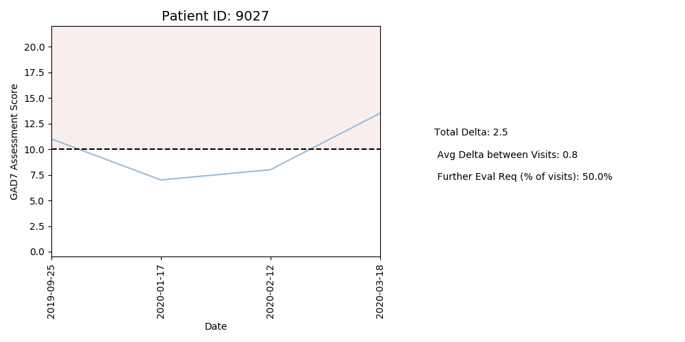

# NF-Take-Home Part 1
## Visualizing Progress

### Task Description: 
The purpose of this analysis is to explore how we can visualize patient progress from the GAD7 assessment data.

#### Data Pipeline:
The steps I took to clean and transform the data can be found in the src/data_pipeline.py file. There were no null values, however, I did find duplicates where patients had multiple scores listed for the same day.  For the purposes of this analysis, I assumed these were "retests", and averaged patient's scores within a single day.

Other transformations included in the pipeline: 
* data types (for ex: made sure 'date' column was a datetime object)
* column 'num_visit' to keep track of the visit count for each patient
* created a column to look at score differences since previous assessment
* simulated ages for patients (using normal distribution centered at 30 y.o. and a sigma of 5 yrs)

#### Patient look-up
The Patient.py file allows us to input a patient id for a quick visualization of their progress. The two figures below are examples of what this file outputs for Patient 9291 and 9027, respectively. 

    

    

#### Thoughts on Improvement Metrics
It would be interesting to look patients who specifically discontinue their sessions because they feel they no longer require therapy. Because mental health is fluid, this seems like a difficult task.  However, I think patterns in these specific patients' scores might be an interesting way to determine the best metric for measuring improvement. For example, if most patients who discontinue therapy have 3 consecutive scores less than 5, maybe it's worth tracking that for other patients.

#### Closer look: Changes in Score from Previous Assessment
The figure below shows the distributions of the measured change in scores from the previous assessment.  The area between the vertical dashed lines captures 90% of the data.  These boundaries are located at -6 and +5.  A delta of +5 means that the patient's score went up by 5 points since the last assessment. Data outside of these boundaries can be considered more rare and might warrant further evaluation, even if the score falls below 10. 

* Note: even though a drop in score of 6 points would be considered a win (meaning patient appears to be less at risk for GAD based on the assessment), the data shows these "swings" to be rare (<5% of the time).  Therefore, identifying these larger changes might still be important.

    

The graph below, although busy, shows some interesting trends. The change in scores from the previous visit are plotted against the number of visits and are colored by score.  Scores that required futher evaluation (score >= 10) are colored in a darker shade of blue.  

    

I thought it was really interesting that scores tended to level off as the number of visit increased, meaning the changes in scores approach zero. This could simply be due to the fact that there were significantly more patients who only with a small number of visits, adding to the variability at the low numbers of total visits (note: I included a distribution of these numbers in the exploration section). Before making any conclusions, it would be important to address that confounding factor.  Confounding factors aside, this chart did help me pinpoint several patients with concerning data.  

For example, I noticed the two points on the upper right side of the graph (visit# between 20-25 and change in score between 8-10), which corresponded to patient# .  These points correThe patient visualization 